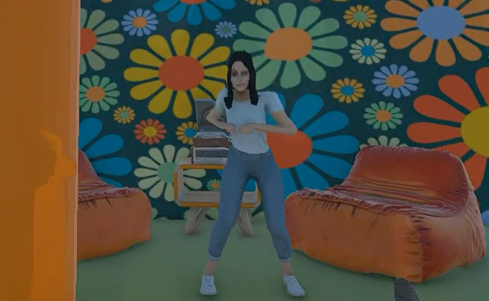
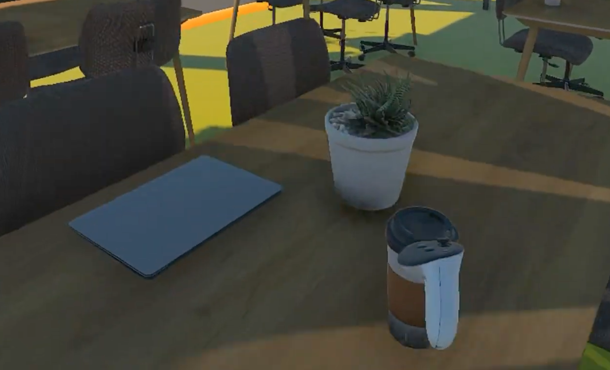
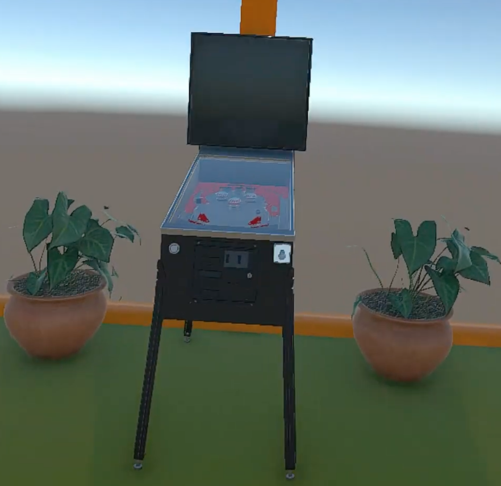

# Inside Langsam 418: A Virtual Reality Recreation of University of Cincinnati's Classroom

Developed by: Kelly Deal, Elshaddai Melaku, Ikran Warsame, Fareena Khan

## Motivation
We wanted to challenge the idea that learning spaces have to feel formal or stressful. Our goal was to design a virtual classroom that prioritizes comfort, creativity, and playfulness, showing how VR can transform an everyday environment into something more personal and inviting.

## Design
**Room Overview:**
We revamped our classroom into a stress free learning space with warm colors, comfy seating, and fun gaming elements. It's designed to feel welcoming and flexible which is perfect for studying solo or hanging out with others.

**Visual Elements:**
The room has comfortable bean bags and chairs, arcade games, a turntable with vinyl record playing 70's music, plants, and everyday objects like coffee cups and laptops. The soft, warm lighting keeps the vibe relaxed, calm, and inviting.

**How We Built It:**
We grabbed assets from Meshy.AI for the fun and more unique stuff (pinball, bean bags), CGTrader for props and furniture, and AvatarSDK for custom avatars. This let us fill the space with quality assets that all looked cohesive.

## Accomplishments by Level
**Level 1:** Furnished the room with comfortable seating (couches & bean bags), warm lighting, and ambient sounds (pinball, music playing from the turntable).

 

**Level 2:** Added interactive objects (coffee cups, laptops, notebooks, pencils, plants) with physics and collision detection.

**Level 3:** Added four custom avatars of ourselves with idle animations (characters dancing) and interactions (they wave as you walk up to them). The large display has a static image but it also has a moving screensaver as you walk up to it.

**Level 3 Bonus:** Created custom avatar characters that look like us using AvatarSDK.com.
| Fareena | Elshaddai | Ikran | Kelly |
|----------|----------|----------|----------|
| |  | | |

**Level 4:** Approaching the pinball machine plays sound, the laptop opens as you near it, the turntable's music grows louder or softer with your distance, and walking up to the avatars makes them stop dancing and wave.

**Level 5:** Added a spinning disco ball with fun lighting effects.

**Credits**
- **[Meshy.AI](https://www.meshy.ai):** Orange bean bag, turntable
- **[CGTrader](https://www.cgtrader.com):** [pencil](https://www.cgtrader.com/free-3d-models/various/various-models/3d-red-pencil-realistic-model), [notebook](https://www.cgtrader.com/free-3d-models/interior/office-interior/notebook-abf827d7-3bbe-435d-a130-a24fb41229dc), [coffee cup](https://www.cgtrader.com/free-3d-models/food/beverage/coffee-cup-ee824c70-b899-425c-b1a7-703e8fe3559b), [tables](https://www.cgtrader.com/free-3d-models/furniture/table/and-tradition-in-between-sk6-table)
- **[Poly Haven](https://polyhaven.com):** [cactus](https://polyhaven.com/a/potted_plant_04), [potted plant](https://polyhaven.com/a/potted_plant_02)
- **[Sketchfab](https://polyhaven.com):** [pinball machine](https://sketchfab.com/3d-models/pinball-machine-cc2a49ca2ad14910abce89b5a78bb09f), [chairs](https://sketchfab.com/3d-models/vintage-office-chair-09259d92dd1c489698199cde905fe837)
- **[Unity Asset Store](https://assetstore.unity.com/):** [side table](https://assetstore.unity.com/packages/3d/props/furniture/free-minimalist-table-189610), [font](https://assetstore.unity.com/packages/2d/fonts/bubble-font-free-version-24987)
- **[AvatarSDK.com](https://avatarsdk.com):** Custom characters
- **[Mixamo.com](https://www.mixamo.com/#/):** Character Animations

**Sounds:**
- **Pinball:** https://youtu.be/gdjx1Dbxpro?si=X661oeg6W-eNQMAY
- **Dancing Queen:** https://youtu.be/h3KJD9G80dc?si=JisPuD0CwySlWxZ6

## Process
- Clone & open in Unity 6.3 LTS (6000.3.1f1)
- Load `SampleScene.unity` and press Play
- Main scripts: `Music.cs`, `Pinball.cs`, `Wave.cs`, `laptop.cs`, `hinge.cs`, `Rotate.cs`, `ShowText.cs`
- Tech: Unity, C#, [Mixamo](https://www.mixamo.com), [Meta Quest 3](https://www.meta.com/quest/quest-3)

The project is a Unity 6.3 LTS scene built for the Meta Quest 3, using OpenXR and the Meta XR SDK for headset and controller input. The entire experience lives in a single scene (`SampleScene.unity`) with all interactions driven by small, focused C# scripts under `Assets/` and `Assets/Scripts/`.

Each interactive object has its own behavior:

- `Music.cs` and `Pinball.cs` adjust audio volume based on the player's distance to the object, fading sound in as you approach and out as you walk away.
- `laptop.cs` swaps between an open and closed laptop model when the player enters or leaves a trigger range.
- `Wave.cs` drives the avatar's animator, switching from a dance loop to a wave when the player gets close.
- `hinge.cs`, `Rotate.cs`, and `ShowText.cs` handle smaller interactions like rotating props and surfacing labels.
- The scripts use the same proximity-based pattern, comparing the player's headset position (CenterEyeAnchor) against each object's transform, which keeps the logic simple and consistent across the room.

## Challenges & Future Work
- It was hard to connect MetaQuest to Unity because there was a lot of bugs when installing, setting it up, and dealing with storage issues.
- Some computers were more compatible than others, and had an easier time rendering and connecting the environment to Unity.
- A teammember couldn't work with the simulator due to having MacOS Intel.
- We initially struggled with connecting the MetaQuest controllers to Unity.
- We had a difficult time asynchronously working on the project since there wasn't an efficient way to share work or have a smooth version control system setup when it comes to Unity, and it slowed down development efficiency and put burden on one of the team members more than the others which felt unfair.
- As we neared the end of the project and we had a ton of assets in Unity that made our programs crash continious and we had a lot of trouble getting the controllers to work.
- In the future we'd continue adding more unique assets and add more AR elements to make the scenes more realistic and fun to interact with.
- We'd love to add multiplayer so people can hang out in the room together.
- A working pinball machine you can actually play, and a turntable where you can swap records.
- A day/night toggle so the room can shift between chill study mode and disco mode.

## AI & Collaboration
Minimal AI usage besides for asset creation - mostly developed manually.

## Demo Video
[Link to demo](https://drive.google.com/file/d/1CcVdJR8fiT5L79GzELgUpgX1q9ONDaav/view?usp=sharing)

